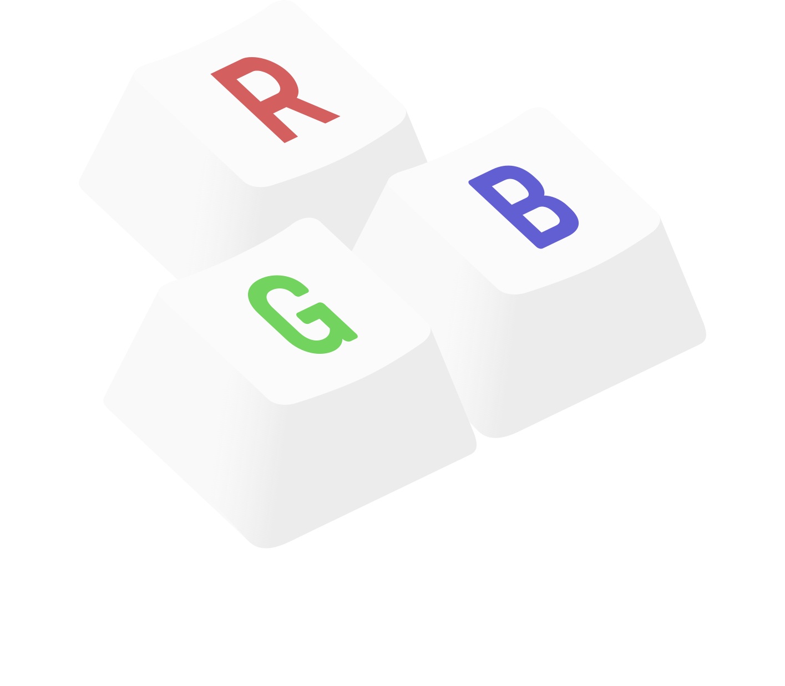

=====================
|logo| keyleds-config
=====================

Advanced RGB animation service for Logitech keyboards — configuration GUI.

Please see the main project, `keyleds`_.

* `issue tracker`_

This project supports all Logitech RGB keyboards, on all keyboard layouts. If yours doesn't
work it's a bug, open a ticket.

Features
--------

This configuration GUI is in early development. Check back later. In the meantime,
text-based keyleds configuration works great even if a bit more tedious ;)

----

Feedback, feature ideas, pull requests are welcome!

.. _keyleds: https://github.com/keyleds/keyleds
.. _issue tracker: https://github.com/keyleds/keyleds-config/issues

